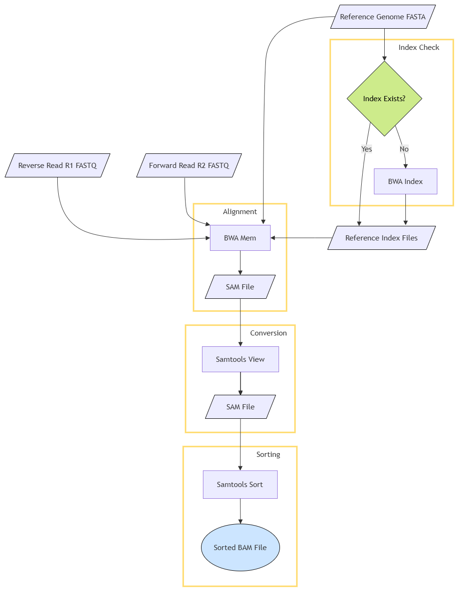

# simple-bioinformatics-pipeline

A containerized bioinformatics pipeline for aligning paired-end DNA sequence reads. The pipeline takes FASTQ files and a reference genome FASTA file as input, and produces coordinate-sorted BAM files as the final output using BWA and SAMtools. The pipeline is containerized with Docker, and the Python script parallel_pipeline.py runs the Docker container across four unique samples concurrently and then logs running time and CPU/memory usage.

## Dataset
The dataset used in the project includes a FASTA file containing the genomic sequence of Saccharomyces cerevisiae (baker's yeast), and several Illumina paired-end FASTQ files. All files used can be found at the following link: https://bioinfogp.cnb.csic.es/files/samples/rnaseq/

## Pipeline
1. Create an index for the reference genome, if it does not already exist, using bwa index.
2. Align paired-end reads (R1 and R2) to the reference genome using BWA mem, the results of which are written to a SAM file.
3. Convert the text-based SAM file to a compressed binary BAM file using samtools view.
4. The BAM file is sorted by genomic coordinates using samtools sort, producing a sorted BAM file.

**Flowchart**

